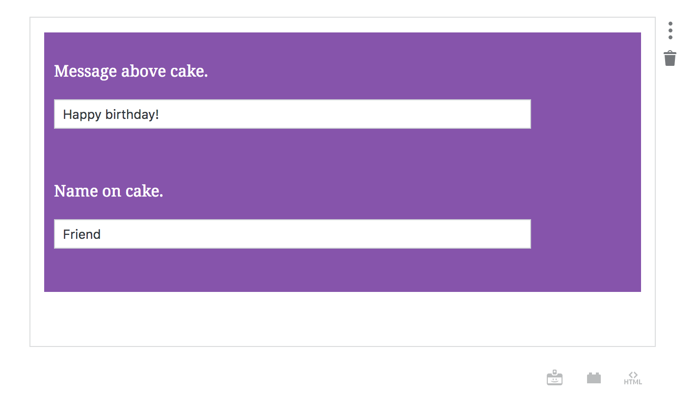

# WordPress Editor Block for Cake

This is a custom block for the new WordPress. For more information about building custom blocks, see [WordPress Custom Editor Block](https://salferrarello.com/wordpress-custom-editor-block/).

## Background

With WordPress 5.0 a new block-based editing experience will be introduced. WordPress provides an API for creating these blocks and this is a plugin to add an example block.

## Screenshots

### In the Back-end Editor When in Focus

### In the Back-end Editor When NOT in Focus

### Front-end Rendering

## Development Requirements

Modifying this plugin does **not** require a preprocessor.  In other words, you can modify this code without npm, babel, webpack, grunt, gulp, yarn, or any other build tool.

## License

Copyright 2018 Iron Code Studio, LLC

Licensed under the Apache License, Version 2.0 (the "License");
you may not use this file except in compliance with the License.
You may obtain a copy of the License at

   http://www.apache.org/licenses/LICENSE-2.0

Unless required by applicable law or agreed to in writing, software
distributed under the License is distributed on an "AS IS" BASIS,
WITHOUT WARRANTIES OR CONDITIONS OF ANY KIND, either express or implied.
See the License for the specific language governing permissions and
limitations under the License.

## Authors

- Eileen Violini ([@_iviolini](https://twitter.com/_iviolini))
- Sal Ferrarello ([@salcode](https://twitter.com/salcode))
